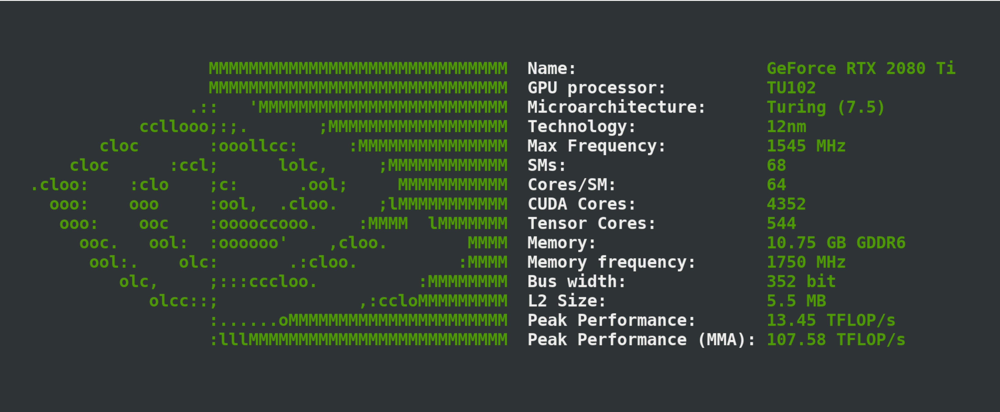

<p align="center"></p>

<div align="center">


[](https://github.com/Dr-Noob/gpufetch/stargazers)
[](https://github.com/Dr-Noob/gpufetch/issues)
[](https://github.com/Dr-Noob/gpufetch/blob/master/LICENSE)

<h4 align="center">Simple yet fancy GPU architecture fetching tool</h4>
&nbsp;



</div>

# Table of contents
<!-- UPDATE with: doctoc --notitle README.md -->
<!-- START doctoc generated TOC please keep comment here to allow auto update -->
<!-- DON'T EDIT THIS SECTION, INSTEAD RE-RUN doctoc TO UPDATE -->


- [1. Support](#1-support)
- [2. Installation (building from source)](#2-installation-building-from-source)
- [3. Colors and style](#3-colors-and-style)
- [4. Bugs or improvements](#4-bugs-or-improvements)

<!-- END doctoc generated TOC please keep comment here to allow auto update -->

# 1. Support
gpufetch supports NVIDIA GPUs under Linux only.

# 2. Installation (building from source)
You will need a C++ compiler (e.g, `g++`), `make` and CUDA to compile `gpufetch`. To do so, just clone the repo and run `make`:

```
git clone https://github.com/Dr-Noob/gpufetch
cd gpufetch
make
./gpufetch
```
When building gpufetch, you may encounter an error telling you that it cannot find some CUDA header files. In this case, is very likely that the Makefile is unable to find your CUDA installation. This can be solved by setting `CUDA_PATH` to the correct CUDA installation path. For example:

```
CUDA_PATH=/opt/cuda make
```

# 3. Colors and style
By default, `gpufetch` will print the GPU logo with the system colorscheme. However, you can always set a custom color scheme, either
specifying "nvidia", or specifying the colors in RGB format:

```
./gpufetch --color nvidia (default color for NVIDIA)
./gpufetch --color 239,90,45:210,200,200:100,200,45:0,200,200 (example)
```

In the case of setting the colors using RGB, 4 colors must be given in with the format: ``[R,G,B:R,G,B:R,G,B:R,G,B]``. These colors correspond to GPU art color (2 colors) and for the text colors (following 2). Thus, you can customize all the colors.

# 4. Bugs or improvements
See [gpufetch contributing guidelines](https://github.com/Dr-Noob/gpufetch/CONTRIBUTING.md)
